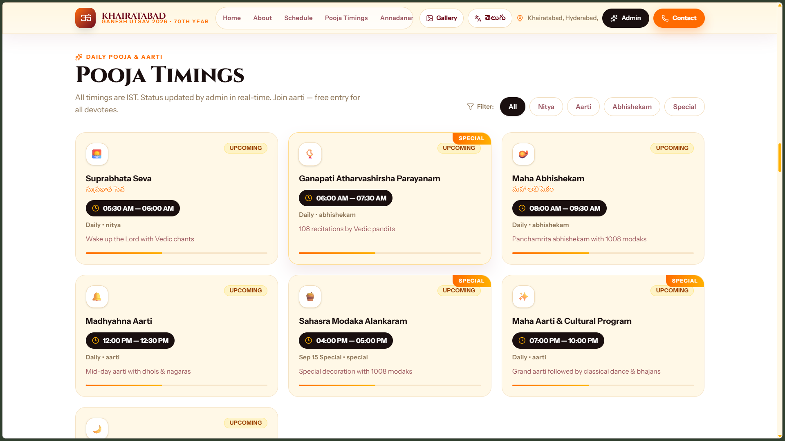
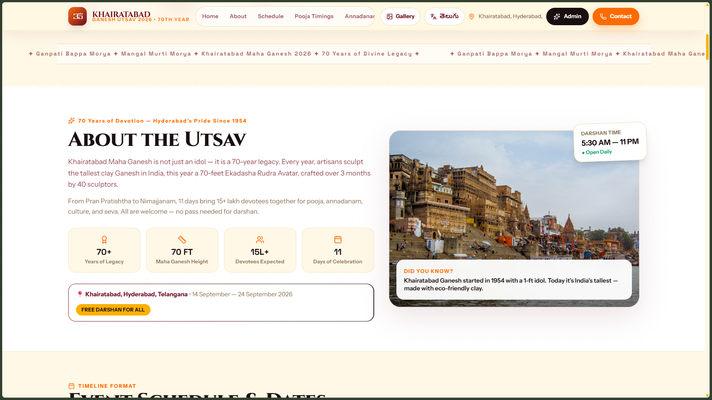
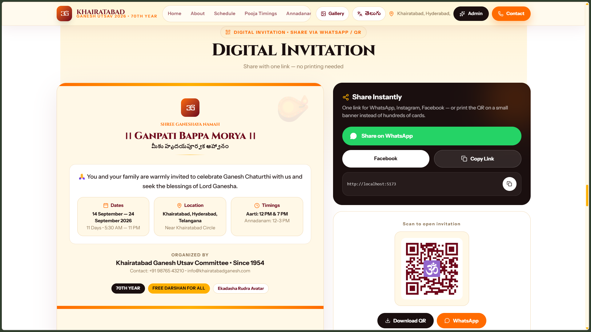

# 🛕 Khairatabad Ganesh Utsav 2026 — Ganpati Bappa Morya

> Awwwards-inspired festival platform for **Khairatabad Maha Ganesh (Hyderabad)** — 70th year, 70-ft Ekadasha Rudra Avatar. Public site with live schedule, poojas, annadanam, nimarjanam route, promotions, gallery and an admin dashboard backed by a fully dynamic **MongoDB + Express** API.

**Live split deployment:** **Frontend → Vercel** + **Backend → Render** (MongoDB Atlas). Fallback demo data so the site always renders even if the API is offline.

---

## Screenshots

> All images are placeholders in [`screenshots/`](screenshots/) — replace them with your real captures. Also mirrored in `docs/images/`.









_Tip: take 1280×720 screenshots of each section and overwrite the files above._

---

## ✨ What This Application Does

- **Public festival site** (`/`) — hero with countdown to `2026-09-14`, marquee, about, schedule (timeline + calendar), pooja grid, annadanam cards, nimarjanam route with map, sponsor/promotion tiers, invitation share (WhatsApp/QR), registration forms (volunteer / annadanam / event / sponsorship / contact), gallery with filters, committee & contact.
- **Bilingual** English + Telugu (extendable) via `frontend/src/lib/i18n.js`.
- **Admin panel** (`/admin` → `/admin/dashboard`) — JWT login, tabs for Festival Settings, Schedule, Pooja, Annadanam, Nimarjanam, Promotions, Gallery, Committee, Registrations. All writes go to MongoDB and reflect instantly on the public site.
- **Resilient** — if MongoDB/API is down, public pages fall back to `frontend/src/data/fallback.js` demo data and show a “Demo mode” banner (`frontend/src/pages/Home.jsx`).
- **Production hardened backend** — helmet, compression, morgan, rate-limit, CORS allowlist, trust-proxy, graceful shutdown, health checks.

---

## 🗂️ Project Structure

```
ganesh-chaturthi/
├── frontend/                 # React 19 + Vite + Tailwind v4
│   ├── src/
│   │   ├── api/client.js     # axios, API_BASE = VITE_API_URL
│   │   ├── components/       # Hero, Navbar, ScheduleSection, PoojaTimings, etc.
│   │   ├── pages/            # Home.jsx, Gallery.jsx, AdminLogin, AdminDashboard
│   │   ├── data/fallback.js  # demo data when DB offline
│   │   └── lib/{utils,i18n}.js
│   ├── public/               # favicon.svg, icons.svg
│   ├── vercel.json           # SPA rewrites, asset cache
│   ├── vite.config.js        # loadEnv proxy /api → :5000
│   └── package.json          # scripts: dev, build, preview, lint
├── server/                   # Node 20 + Express 5 + Mongoose 8
│   ├── server.js             # API-only (Vercel hosts frontend)
│   ├── config/db.js
│   ├── middleware/auth.js    # JWT protect + adminOnly
│   ├── models/               # Settings, Pooja, Annadanam, Nimarjanam, Promotion, Gallery, Committee, Schedule, Registration, User
│   ├── routes/               # auth, settings, pooja, annadanam, nimarjanam, promotions, gallery, committee, schedule, registrations
│   ├── seed/seed.js
│   └── package.json          # dev, start, seed
├── screenshots/              # 6 placeholder images (replace me)
├── docs/images/              # mirror of screenshots
├── render.yaml               # Render Blueprint for backend (rootDir: server)
└── docs: ARCHITECTURE.md, DEVELOPMENT.md, DEPLOYMENT.md, CONFIGURATION.md, OPERATIONS.md, RUNBOOK.md, TROUBLESHOOTING.md, SECURITY.md, API.md, CHANGELOG.md
```

---

## 🧰 Tech Stack

| Layer    | Tech                                                                                                                  |
| -------- | --------------------------------------------------------------------------------------------------------------------- |
| Frontend | React 19, Vite 6, React Router 7, Tailwind CSS v4 (`@tailwindcss/vite`), GSAP 3 + ScrollTrigger, Framer Motion, Lenis |
| Backend  | Node ≥18, Express 5, Mongoose 8, JWT + bcryptjs, cors, helmet, compression, morgan, express-rate-limit, dotenv        |
| DB       | MongoDB (local or Atlas)                                                                                              |
| Deploy   | Vercel (frontend), Render (backend)                                                                                   |
| Tooling  | pnpm, nodemon (server dev), ESLint                                                                                    |

Design tokens: `saffron #FF6B00`, `maroon #6D071A`, `gold #FFB000`, `cream #FFF8E7`; fonts Cinzel / Instrument Sans / Space Grotesk / Cormorant Garamond.

---

## ✅ Prerequisites

- **Node.js 20** (`.nvmrc` pins 20) — check with `node -v`
- **pnpm 8+** — `npm i -g pnpm` or `corepack enable`
- **MongoDB** — local `mongod` or free Atlas cluster
- Git, modern browser

---

## 🚀 Setup

```bash
# 1) Clone
git clone <your-repo-url> ganesh-chaturthi && cd ganesh-chaturthi

# 2) Install
pnpm --prefix frontend install
pnpm --prefix server install
# or from each folder: cd frontend && pnpm install

# 3) Env — copy examples
cp frontend/.env.example frontend/.env
cp server/.env.example server/.env
# Edit server/.env: set MONGO_URI, JWT_SECRET (≥32 chars), FRONTEND_URL, ADMIN_EMAIL/PASSWORD
# Edit frontend/.env: keep VITE_API_URL=/api for local (Vite proxies to :5000)

# 4) Start MongoDB (if local)
mongod --dbpath /data/db

# 5) Seed demo data (needs MongoDB running)
pnpm --prefix server run seed
# Creates: Settings, 7 Poojas, 11 Annadanam days, Nimarjanam, 5 Promotions, 9 Gallery, 4 Committee, Schedule timeline, admin user

# 6) Run
pnpm --prefix server run dev   # http://localhost:5000  (GET /api/health)
pnpm --prefix frontend run dev # http://localhost:5173  (proxies /api → :5000)
```

**Verify:**

- `curl http://localhost:5000/api/health` → `{ status: "ok", db: "connected" }`
- Open `http://localhost:5173` — banner should say “Connected — Data from MongoDB” (or “Demo mode” if DB offline, still renders).

Login: `http://localhost:5173/admin` → `ADMIN_EMAIL` / `ADMIN_PASSWORD` from `server/.env`.

---

## 📜 Scripts

**Frontend (`frontend/package.json`)**

```bash
pnpm dev        # vite on :5173
pnpm build      # vite build → dist/
pnpm preview    # preview on :4173
pnpm lint       # eslint
```

**Backend (`server/package.json`)**

```bash
pnpm dev        # nodemon server.js on :5000
pnpm start      # node server.js (Render uses this)
pnpm seed       # node seed/seed.js
```

Vite proxy: `vite.config.js` uses `loadEnv` → `VITE_PROXY_TARGET` or `http://localhost:5000` for `/api`.

---

## 🔌 Basic Usage

**Public:**

- Scroll through sections via Navbar or anchor links (`#schedule`, `#pooja`, etc.).
- Gallery → filter by category, lightbox modal.
- Schedule → toggle Timeline / Calendar, filter by `pran_pratishtha` / `daily_pooja` / `cultural` / `nimajjanam` etc.
- Registration → pick type (volunteer/annadanam/event/sponsorship/contact), submit → `POST /api/registrations` (honeypot + validation).
- Share invitation → WhatsApp, copy link, QR download.

**Admin:**

- `/admin` login → JWT stored as `ganesh_token` (also `ganesh_user`).
- Dashboard tabs → CRUD via `frontend/src/api/client.js`. Settings/Nimarjanam are singleton `PUT`, others are list with `POST/PUT/DELETE` + `PATCH /:id/status` where needed.
- Registrations tab → filter by type/status, update status (`pending→confirmed`), delete.

**Fallback behavior:** `Home.jsx` does `Promise.allSettled` for 7 resources; any fulfilled array with items replaces fallback, otherwise demo data stays. Guarantees no blank page.

---

## 🔐 Environment Variables

See **[CONFIGURATION.md](CONFIGURATION.md)**. Never commit `.env`.

- **Frontend (Vercel):** `VITE_API_URL` → `/api` locally, `https://<render>.onrender.com/api` in production.
- **Backend (Render):** `NODE_ENV=production`, `MONGO_URI` (Atlas), `JWT_SECRET`, `FRONTEND_URL` (= Vercel URL), optional `ALLOWED_ORIGINS`, `ADMIN_EMAIL`, `ADMIN_PASSWORD`, `PORT` (auto).

---

## 🌐 Deployment

Split deploy is recommended (also see **[DEPLOYMENT.md](DEPLOYMENT.md)**):

- **Backend Render:** Blueprint from `render.yaml` (`rootDir: server`, `build: pnpm install --frozen-lockfile`, `start: pnpm start`, health `/api/health`). Set env vars in dashboard. Seed once via Shell.
- **Frontend Vercel:** Import repo, framework Vite, `build: pnpm build`, `output: dist`, env `VITE_API_URL=https://<render>/api`. `vercel.json` handles SPA rewrites + `Cache-Control: immutable` for `/assets/*`.

---

## 📚 More Docs

- [ARCHITECTURE.md](ARCHITECTURE.md) — system design, data flow, decisions
- [DEVELOPMENT.md](DEVELOPMENT.md) — local dev, testing, contributing
- [DEPLOYMENT.md](DEPLOYMENT.md) — build, staging/prod, rollback
- [CONFIGURATION.md](CONFIGURATION.md) — env vars, files
- [OPERATIONS.md](OPERATIONS.md) — day-to-day prod ops
- [RUNBOOK.md](RUNBOOK.md) — incident runbooks
- [TROUBLESHOOTING.md](TROUBLESHOOTING.md) — common errors
- [SECURITY.md](SECURITY.md) — practices, reporting
- [API.md](API.md) — endpoints, auth, examples
- [CHANGELOG.md](CHANGELOG.md) — releases

Sub-readmes: [frontend/README.md](frontend/README.md), [server/README.md](server/README.md)

---

## 🙏 Ganpati Bappa Morya!

Questions? Open an issue or contact `info@khairatabadganesh.com`.

Built for Bappa’s 70th year at Khairatabad — Hyderabad’s pride since 1954.

# ganesh-chaturthi
