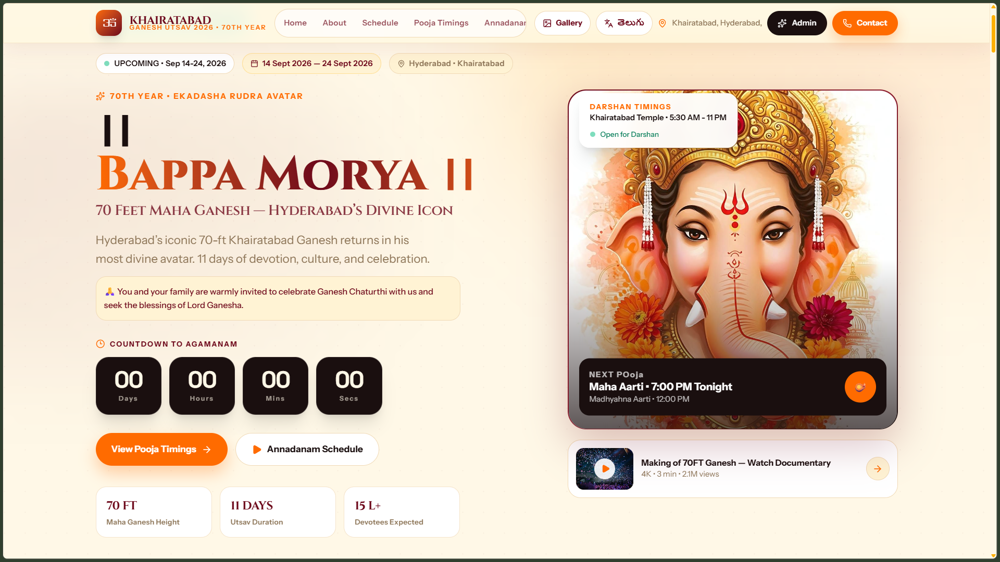
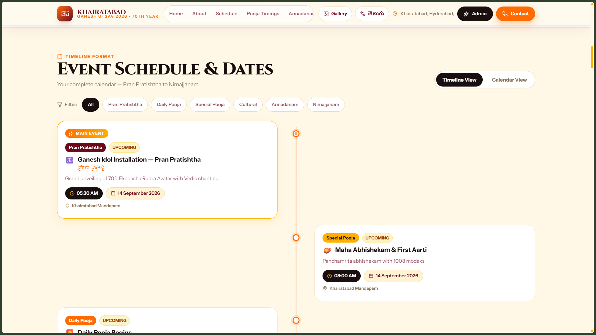
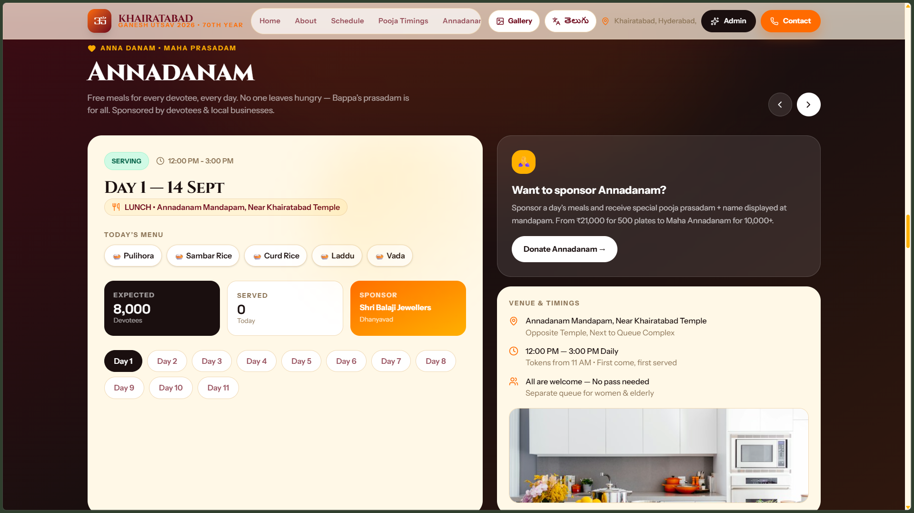
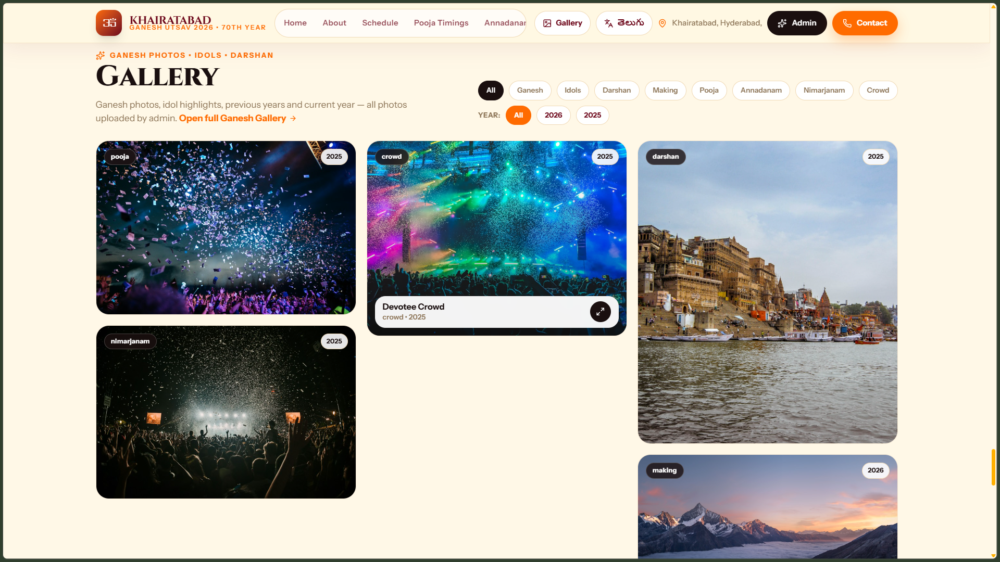
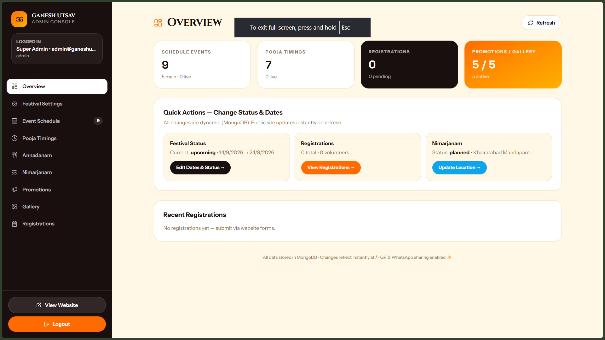
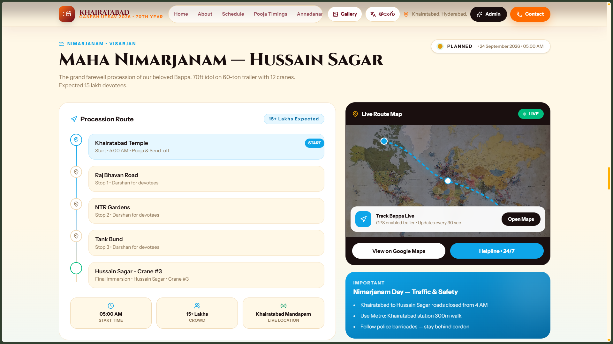

# docs/images — Mirrored Screenshots

Mirror of [`../../screenshots/`](../../screenshots/) for documentation tooling. Canonical source is `screenshots/` — this folder is a 1:1 copy so docs and GitHub Pages tools that resolve `docs/images/` also work.

> **Repo:** `https://github.com/sai4u-dev/ganesh-chaturthi.git` — `git clone https://github.com/sai4u-dev/ganesh-chaturthi.git`

## Preview

| Hero & Countdown | About the Utsav | Schedule |
| --- | --- | --- |
|  |  |  |
| `01-hero.png` | `02-about-the-utsav.png` | `02-schedule.png` |

| Pooja Timings | Annadanam | Gallery |
| --- | --- | --- |
|  |  |  |
| `03-pooja.png` | `04-annadanam.png` | `05-gallery.png` |

| Admin Dashboard | Maha Nimarjanam | Digital Invitation |
| --- | --- | --- |
|  |  |  |
| `06-admin.png` | `07-maha-nimarjanam.png` | `08-digital-invitation.png` |

## Files (9 × 1920×1080 PNG)

```
01-hero.png               — Hero & countdown
02-about-the-utsav.png     — About the Utsav
02-schedule.png            — Schedule (timeline & calendar)
03-pooja.png               — Pooja timings
04-annadanam.png           — Annadanam
05-gallery.png             — Gallery
06-admin.png               — Admin dashboard
07-maha-nimarjanam.png     — Maha Nimarjanam
08-digital-invitation.png  — Digital Invitation
```

> Keep in sync with `../../screenshots/` — overwrite both locations when updating a capture.
